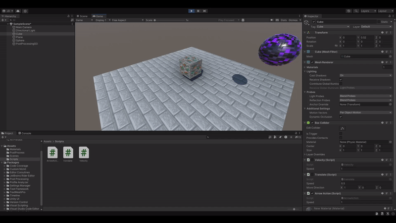

# Practica 3 - Fisicas

## Ejercicio 1:

En este se muestra la multiplicación de los ejes vertical y horizontal por un valor de velocidad decidido por el usuario, en este caso 1.

## Ejercicio 2:

Para poder reasignar la tecla de `disparo` hay que acceder a las preferencias del proyecto y cambiarlo desde ahí.

## Ejercicio 3-4:

Script de movimiento sin físicas a través del transform utilizando el `Translate`. Se ha utilizado desde ya el `Time.deltaTime` para que el objeto no abandone el campo de visión en 2 frames.

Por lo tanto el ejercicio 4 esta combinado en este.

## Ejercicio 5:

Se añade el movimiento en 2D tanto del cubo como de la esfera, con esquemas de control diferentes para cada uno.

## Ejercicio 6:

Se automatiza el movimiento del cubo para que este se mueva constantemente en la dirección de la esfera.

## Ejercicio 7:

En esta primera versión del script que rota el cubo para que mire constantemente a la esfera, se puede ver que el cubo no rota correctamente, ya que su movimiento es relativo a si mismo lo que proboca que pibote parcialmente alrededor de la esfera.

En esta segunda versión se referencia el movimiento con respecto al mundo por lo que funciona como se espera.

## Ejercicio 8:

En este ejercicio se añade una especie de control de tanque a el cubo. En este movimiento avanza constantemente hacia adelante y lo hacemos rotar con el eje horizontal.

## Ejercicio 9:

En este ejercicio hemos añadido un rigidbody a el cilindro, y además lo hemos tenido que hacer el objeto controlable ya que para que ocurran colisiones correctamente entre objetos sin rigidbody, como el cubo y la esfera, uno de los dos tiene que tenerlo y dado que son coliders estáticos no producirán colisiones si son estos los que se mueven.

## Ejercicio 10:

En este ejercicio se ha añadido un rigidbody al cubo y la esfera, se ha dado la cualidad de Kinematic al rigidbody del cubo. Se puede observar que con el cilindro no somos capaces de empujar el cubo, pero si la esfera. Además el cubo no se cae por la gravedad.

## Ejercicio 11:

Ahora hemos convertido el cilindro en un trigger por lo que ha perdido las colisiones fñisicas pero cambiando un poco el código de `OnColisionEnter` a `OnTriggerEnter` mantenido la detección de colisiones enrre objetos en la consola.

## Ejercicio 12:

Ahora con otro cilindro y un nuevo sistema de movimientos por físicas (`AddForce`) hemos hecho que se pueda mover y colisionar con los elementos de la escena, además se le ha limitado la velocidad máxima a 10 para evitar que salga de la escena. 

Se han creado 2 esferas adicionales, la textura morada (original) tiene una masa de 1, la misma que la de nuestro cilindro, y se puede ver que la podemos empujar aunque con un pelín de dificultad.

La esfera con textura roja tiene una masa de 10, por lo que es mucho más difícil de mover, sobre todo cuando empezamos a empujarla.

La esfera con textura azul claro tiene una masa de 0.1, por lo que es muy fácil de mover, ahora el problema es que la empujamos demaciado fácil y es difícil de controlar.

Ahora hemos decidido aplicar la cualidad Kinematic a nuestro cilindro, o que causa que nuestro sistema de movimiento por físicas no funcione ya que las fuerzas no se estan aplicando, tampoco es posible empujarlo ni le afecta la gravedad.

Ahora Hemos dado la cualidad isTrigger a nuestro cilindro, por lo que ahora no tenemos colisión alguna con ninguno de nuestros objetos pero si que nos afecta la gravedad.

Aqui podemos ver como afecta el rozamiento a nuestro cilindro.

## Notas finales:

Se han utilizado texturas que yo mismo he creado a partir de las texturas de minecraft, añadiendoles mapas normales y de rugosidad para darles un aspecto más realista, ya que eran parte de un proyecto personal y me pareción buena idea utilizarlas en lugar de colores planos.